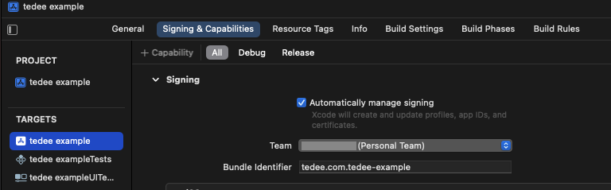

# Tedee lock communication example

## About

This example project was created by [Tedee](https://tedee.com) team to show you how to operate Tedee lock using Bluetooth Low Energy communication protocol.

This project was created using Swift language and run it on iOS device.

Purpose of this project is to present how you can open bluetooth connection with Tedee Lock, start encrypted session and operate it (currently only the `Unlock` command is implemented).

App uses native iOS Bluetooth stack and custom implementation of secure session. It is not using any Tedee services and works only locally within range of BLE. During preparation steps you will have to get lock certificate manually.

Using this example you will be able to operate only one lock a time.

> :warning: This is just a simplified example of how to connect and send commands to lock. It omits security concerns, error handling, and best practices. This is not production-ready code.

## Requirements

### Hardware
1. Tedee Lock - you can order it in our [online store](https://tedee.com/shop/)
2. iPhone (real device) with iOS 16.2+ and installed [Tedee](https://apps.apple.com/us/app/tedee/id1481874162) app
3. Mac with `Monterey` or newer macOS installed
4. USB - Lightning cable (to connect iPhone to Mac)

### Software
1.  Xcode 14.2+ from [App Store](https://apps.apple.com/pl/app/xcode/id497799835?mt=12)

### Other
1. Tedee account created in Tedee app
2. Lock is paired with (added to) Tedee account.
3. Lock `Serial number` and `Device ID` from Tedee app
	- go to: `Lock details > Settings (gear icon) > Information`

> :warning: This project cannot be run on Xcode simulator, you will have to run it on physical device (iPhone).

## Initial configuration

### Step 1 - configure Xcode project
1. clone this repository
2. open `tedee example.xcodeproj` file in Xcode
3. in file navigator select `tedee example` and choose target `tedee example` from `TARGETS`
4. change tab to `Signing & Capabilities`

7. change `Team` to `Personal Team`
8. change `Bundle Identifier` to something else, for example: `[YOUR COMPANY DOMAIN].tedee-example`

### Step 2 - Pairing iPhone with Xcode

1. On iPhone go to `Setting > Privacy & Security`, scroll to the bottom to `Security` section, tap on `Developer Mode` and enable it
2. Connect iPhone to your Mac with `USB - Lightning` cable
3. Click in the top bar on `Any iOS Device` or similar text right to `tedee example` target

5. Click on `Add Additional Simulators...`

6. Cancel `Create a new simulator` window
7. On the left sidemenu select `Devices` and click on the `+` icon at the bottom
8. Select connected iPhone from the list

9. Tap `Trust` on iPhone to trust your Mac connection and confirm with your iPhone passcode  

9. Click Done  

10. You can select `Connect via Network` for connecting Xcode to iPhone via WiFi but we do not recommend this if you do not have experience with Xcode  

11. Now you should see you iPhone in top bar, if it's not click and select it from devices list

### Step 3 - Running project

**Now you are ready to build the project and upload it to your iPhone.**

1. `Cmd + R` will build project and run it on connected iPhone.
2. Unlock your iPhone during build to give Xcode right to upload and start app on it.

#### First Launch

On first launch app will ask you for permission to use Bluetooth.

App will also generate public key that is required to lock certificate (see next steps). Look for `Public key to register in api:` in Xcode console. If it didn't opened tap on the   in bottom bar to open Xcode console. You will see there also steps that are taken by the app to unlock the lock (connect, start encrypted session, send unlock command, receive response).

### Step 4 - register tedee example app
1. log in to [Tedee Portal](https://portal.tedee.com) with credentials from created Tedee account
2. click on your initials in top right corner

4. click on Personal Access Keys and generate new access key with at least **Device certificates - Read** permission
5. Go to [Tedee API](https://api.tedee.com) and authorize yourself with created Personal Access Key
	1. 
	2. proper format is `PersonalKey [YOUR PERSONAL ACCESS KEY]`
	3. confirm with `Authorize`
	4. go to `Mobile` section and use `POST /api/[api version]/my/mobile` route and click on try it out
	
	5. enter `name` (lock name from Tedee iOS app), `operatingSystem` set to `3` and `publicKey` the one that was generated by `tedee example` app on first launch
	6. response will return `id` that is required in next step (as `MobileID`)
	7. go to `DeviceCertificate` section and use `/api/[api version]/my/devicecertificate/getformobile`
	
	5. click on `Try it out`
	6. fill `MobileID` gathered from previous request response and `Device ID` from Tedee app
	7. store somewhere response result, you will need it in next step

> :warning: Generated certificate has expiration date, which is attached to the response with certificate. After certificate expiration you will not be able to operate the lock and you need to get new one.

### Step 4 - fill required configuration

1. open `Configuration.swift` in project navigator
2. replace empty value of `SerialNumber` with your Tedee lock serial number
3. replace empty value of `MobilePublicKeyString` with `Public key` you see in Xcode console
4. replace empty value of `DevicePublicKeyString` with `devicePublicKey` value from last API request results
5. replace empty value of `CertificateString` with `certificate` value from last API request results

### Step 5 - operate the lock

1. compile and run app again with `Cmd + R`
2. if everything is configured properly you should be able to unlock the lock.

